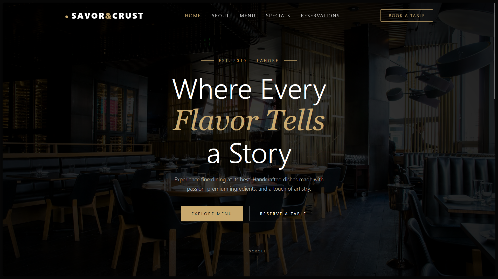

# SAVOR & CRUST RESTAURANT

A beautifully designed, fully responsive multi-page restaurant website built with React and Framer Motion animations.



## Live Demo

**🌐 Live URL:** https://maq2008.github.io/SAVOR-AND-CRUST-RESTAURANT/

> **Note:** This website uses HashRouter for GitHub Pages compatibility.
> Navigation URLs include `/#/` prefix (e.g., `/#/menu`, `/#/about`)

## Pages

| Page | Route | Description |
|------|-------|-------------|
| 🏠 Home | `/#/` | Hero section with parallax effect |
| 📖 About | `/#/about` | Our story, timeline, and values |
| 🍽️ Menu | `/#/menu` | Filterable menu with 12 items |
| ⭐ Specials | `/#/specials` | Weekend brunch, tasting menu, private dining |
| 📞 Reservations | `/#/reservations` | Contact info and FAQs |
| 📅 Book a Table | `/#/book` | Reservation form |

## Features

- ✨ **Smooth Animations** - Scroll-triggered fade, slide, and scale animations
- 🎭 **Parallax Effects** - Hero sections with parallax scrolling
- 📱 **Fully Responsive** - Works perfectly on mobile, tablet, and desktop
- 🌙 **Dark Theme** - Elegant dark design with gold (#c9a96e) accents
- ⚡ **Fast Loading** - Vite build with optimized assets

## Tech Stack

| Technology | Description |
|------------|-------------|
| **React** | UI library for building components |
| **React Router (HashRouter)** | Client-side routing (GitHub Pages compatible) |
| **Framer Motion** | Animation library for scroll animations |
| **Vite** | Fast build tool and dev server |
| **GitHub Pages** | Free hosting platform |

## Getting Started

### Run Locally

```bash
# Clone the repository
git clone https://github.com/maq2008/SAVOR-AND-CRUST-RESTAURANT.git
cd SAVOR-AND-CRUST-RESTAURANT

# Install frontend dependencies
cd frontend
npm install

# Start development server
npm run dev
```

### Build for Production

```bash
cd frontend
npm run build
```

Build output will be in `frontend/dist/` folder.

## Project Structure

```
SAVOR-AND-CRUST-RESTAURANT/
├── .github/
│   └── workflows/
│       └── deploy.yml          # GitHub Actions auto-deploy
├── frontend/
│   ├── src/
│   │   ├── components/         # Reusable components
│   │   │   ├── Navbar.jsx      # Navigation with active states
│   │   │   ├── Footer.jsx      # Site footer
│   │   │   └── ScrollReveal.jsx # Scroll animation wrapper
│   │   ├── pages/              # Page components
│   │   │   ├── HomePage.jsx    # Landing page
│   │   │   ├── AboutPage.jsx   # About us
│   │   │   ├── MenuPage.jsx    # Menu with filtering
│   │   │   ├── SpecialsPage.jsx # Specials & events
│   │   │   ├── ReservationsPage.jsx
│   │   │   └── BookPage.jsx    # Reservation form
│   │   ├── data/
│   │   │   └── menuData.js     # Static menu items
│   │   ├── App.jsx             # Main app with routing
│   │   └── index.css           # Global styles
│   └── vite.config.js          # Vite configuration
├── screenshot.png               # Website screenshot
└── README.md                   # This file
```

## Deployment

This project is automatically deployed to GitHub Pages using GitHub Actions.

Every push to `main` branch triggers the deployment workflow:
1. Node.js setup
2. Dependencies installation
3. Production build
4. GitHub Pages deployment

## Color Palette

| Color | Hex | Usage |
|-------|-----|-------|
| Black | `#0a0a0a` | Main background |
| Dark | `#0d0d0d` | Section backgrounds |
| Gold | `#c9a96e` | Primary accent |
| White | `#fff` | Headings, text |
| Gray | `#999999` | Secondary text |

## License

© 2026 SAVOR & CRUST Restaurant. All rights reserved.

---

**Made with ❤️ by Abdullah Qureshi**